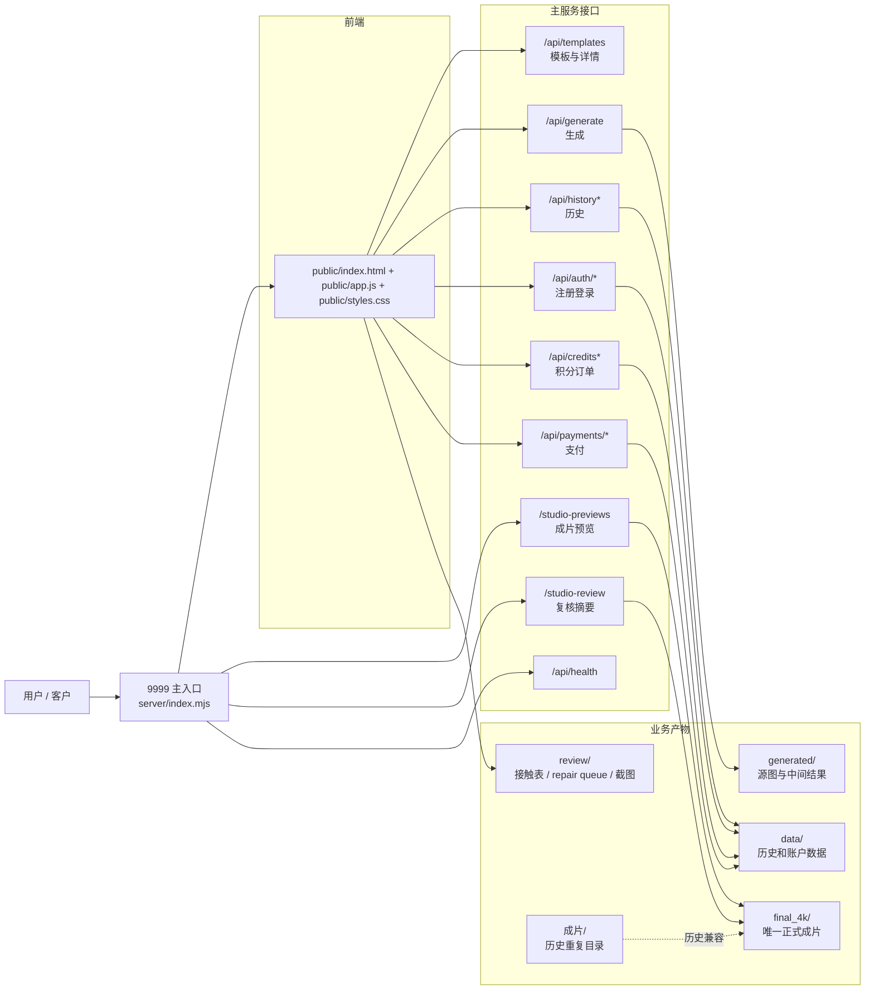
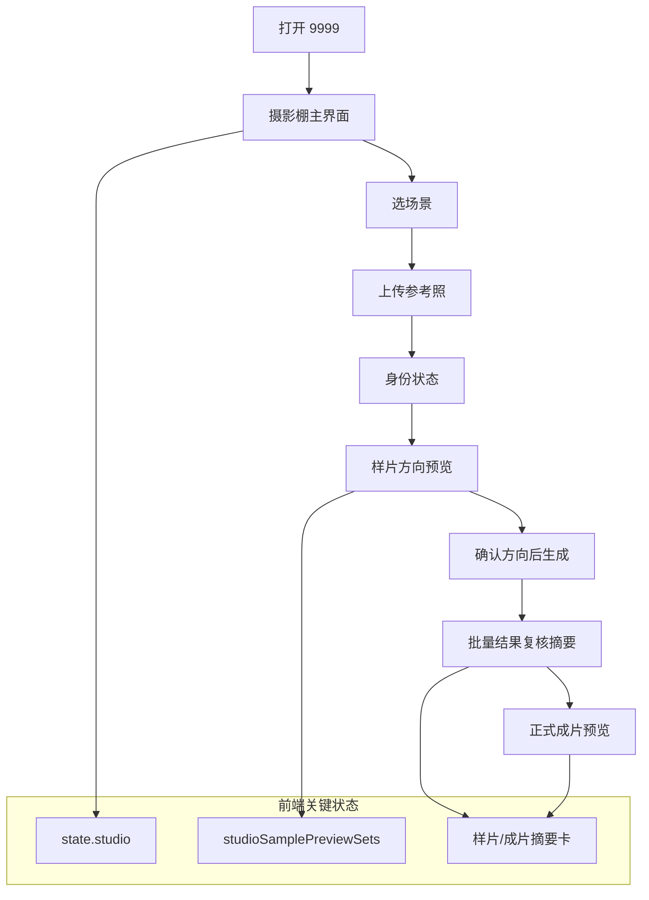
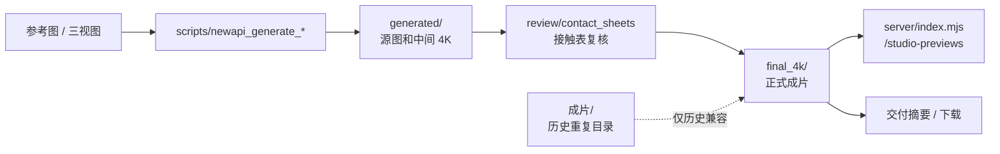

# 墨境当前代码逻辑图

日期： 2026-05-02
模式： doc
工作区： `/Users/dy3000/code/pic`

## 1. 一句话结论

当前真实运行逻辑已经是一套主应用：

- 用户访问 `9999`
- Node 服务是 `server/index.mjs`
- 正式成片目录是 `final_4k/`
- `成片/` 只是历史重复目录，不参与现行正式交付口径

## 2. 当前主逻辑图

## 3. 摄影棚主流程

说明：

- 样片阶段和成片阶段都在主应用里
- 当前样片管理还没有彻底抽成单独模块，但已经不再需要第二个独立入口

## 4. 场景生产与交付链路

说明：

- 正式交付链路已经收口到 `final_4k/`
- 生成脚本和 执行报告 需要继续跟着这条链路统一

## 5. 当前代码现实

现在最关键的 5 点：

1. 当前主入口是 `9999`
2. 当前主服务是 `server/index.mjs`
3. 当前正式成片目录是 `final_4k/`
4. 样片管理仍需进一步模块化
5. `成片/` 还在磁盘里，但已经不应再被写成并行正式输出

## 6. 这张图怎么用

后续讨论和重构都按这 3 条展开：

1. 继续把样片、复核、交付从主应用内部拆成清楚的模块
2. 继续把目录收成“一个代码根目录 + 子文件夹”
3. 最后再清理 `成片/` 这类历史重复目录
